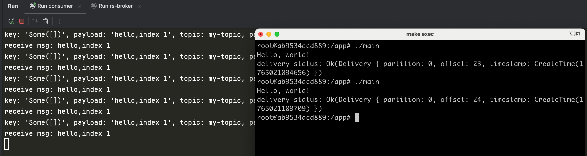

# rust rdkafka

rust使用rdkafka实现消息发送和消费

- rust rdkafka官网: https://crates.io/crates/rdkafka
- rdkafka crate: https://github.com/fede1024/rust-rdkafka 更多用法看官方examples
- librdkafka官网：https://github.com/confluentinc/librdkafka the Apache Kafka C/C++ library
- rust kafka实现消息发送和消费，这里使用的是rdkafka，相比rskafka和kafka crate，稳定性和兼容性更好。
- rdkafka这个库是基于c语言编写的，性能高。
- 如果不需要kafka更多配置，可以直接使用kafka = "0.10.0" 这个crate: https://crates.io/crates/kafka

基于rdkafka封装的broker见: https://github.com/rs-god/rust-broker

# kafka in docker

启动kafka容器

```shell
docker-compose up -d
```

进入容器后，创建topic

```shell
cd /opt/kafka
bin/kafka-topics.sh --create --topic my-topic --bootstrap-server localhost:9092
```

# install librdkafka

- macos安装方式：

```shell
brew install pkgconf
brew install zlib
brew install librdkafka
```

- apt安装方式：

1. 安装相关依赖

```shell
apt-get install -y build-essential libcurl4-openssl-dev libssl-dev zlib1g-dev pkg-config wget curl
```

2. 源码cmake编译安装

```shell
cd /opt && wget https://github.com/confluentinc/librdkafka/archive/refs/tags/v2.12.1.tar.gz
tar -zxf v2.12.1.tar.gz && cd /opt/librdkafka-2.12.1 && mkdir build && cd build && cmake ..
make && make install
```

3. 设置环境变量

```shell
export PKG_CONFIG_PATH=/usr/local/lib/pkgconfig
export PKG_CONFIG_ALLOW_SYSTEM_LIBS=1
export PKG_CONFIG_ALLOW_SYSTEM_CFLAGS=1
```

建议将上面的环境变量设置放入`~/.bash_profile`文件，然后执行`source ~/.bash_profile`生效。

4. 查看是否安装成功

```shell
pkg-config --modversion rdkafka
```

# rdkafka in docker

```shell
# 构建rust运行环境的基础镜像
make build-dev
```

构建容器镜像

```shell
make build
```

运行容器

```shell
make run
```

进入容器运行消息发送

```shell
docker exec -it rs-broker /bin/bash
#root@ab9534dcd889:/app# ls
#bin  main
#root@ab9534dcd889:/app# ./main
#Hello, world!
#delivery status: Ok(Delivery { partition: 0, offset: 15, timestamp: CreateTime(1765010845887) })
#root@ab9534dcd889:/app#
```

运行效果如下：

